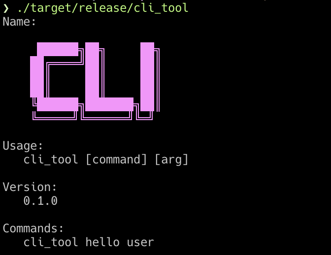
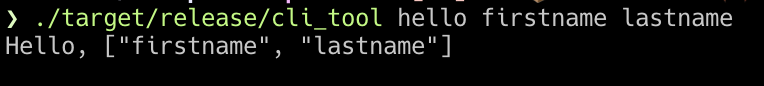

# seahorse

[](https://crates.io/crates/seahorse)


A minimal CLI framework written in Rust

## Using

```toml
[dependencies]
seahorse = "0.3.1"
```

## Example

### Multiple action app
```rust
use std::env;
use seahorse::{App, Action, Command, color};

fn main() {
    let args: Vec<String> = env::args().collect();
    let action: Action = |v: Vec<String>| println!("Hello, {:?}", v);
    let display_name = color::magenta("
     ██████╗██╗     ██╗
    ██╔════╝██║     ██║
    ██║     ██║     ██║
    ██║     ██║     ██║
    ╚██████╗███████╗██║
    ╚═════╝╚══════╝╚═╝");
    let command = Command::new("hello", "cli_tool hello user", action);

    let app = App::new()
        .name("cli_tool")
        .display_name(display_name)
        .usage("cli_tool [command] [arg]")
        .version(env!("CARGO_PKG_VERSION"))
        .commands(vec![command]);

    app.run(args);
}
```




### Single action app
```rust
use std::env;
use seahorse::{SingleApp, Action, color};

fn main() {
    let args: Vec<String> = env::args().collect();
    let action: Action = |v: Vec<String>| println!("Hello, {:?}", v);
    let display_name = color::magenta("
     ██████╗██╗     ██╗
    ██╔════╝██║     ██║
    ██║     ██║     ██║
    ██║     ██║     ██║
    ╚██████╗███████╗██║
    ╚═════╝╚══════╝╚═╝");

    let app = SingleApp::new()
        .name("cli_tool")
        .display_name(display_name)
        .usage("cli_tool [args]")
        .version(env!("CARGO_PKG_VERSION"))
        .action(action);

    app.run(args);
}
```